# E2E Perception Framework


基于 PyTorch Lightning 的模块化感知系统，提供从模型开发到生产部署的全流程支持。

## 核心特性

- 🧩 **模块化架构**：6 大核心模块域，20+ 可扩展组件类型
- ⚡ **动态构建系统**：基于 YAML 配置的智能组件实例化
- 🔍 **类型安全验证**：运行时参数校验与循环依赖检测
- 🚀 **多阶段支持**：训练 / 验证 / 推理 / 部署全流程覆盖
- 🌐 **多模态扩展**：跨模态融合与对齐的标准化实现

## 项目结构

```text
e2e_perception/
├── src/                    # 源代码
│   ├── core/               # 核心基础设施
│   │   ├── registry.py     # 注册器系统实现
│   │   └── builders.py     # 智能构建工具
│   ├── components/         # 可注册组件实现
│   │   ├── model/         # 模型组件
│   │   ├── data/          # 数据处理
│   │   ├── trainer/       # 训练组件
│   │   ├── evaluation/    # 评估体系
│   │   ├── deploy/        # 部署优化
│   │   └── multimodal/    # 多模态处理
│   ├── pipelines/         # 完整流程组合
│   └── utils/             # 通用工具
├── configs/               # 配置模板
├── tests/                 # 测试套件
└── examples/              # 使用示例
```

## 组件关系结构



```mermaid
graph TD;
    L[LIGHTNING] --> M[MODEL];
    L --> D[DATA];
    L --> T[TRAINER];
    L --> E[EVALUATION];
    L --> DP[DEPLOY];
    L --> MM[MULTIMODAL];

    M --> BB[Backbones];
    M --> NK[Necks];
    M --> HD[Heads];
    M --> LS[Losses];
    M --> AT[Attention];
    M --> NL[Norm Layers];
    M --> PE[Positional Encoding];

    D --> DS[Datasets];
    D --> TR[Transforms];
    D --> SA[Samplers];
    D --> LD[Loaders];

    T --> OPT[Optimizers];
    T --> SCH[Schedulers];
    T --> CB[Callbacks];
    T --> LG[Loggers];
    T --> ST[Strategies];

    E --> MT[Metrics];
    E --> AN[Analyzers];
    E --> VZ[Visualizers];

    DP --> CV[Converters];
    DP --> QT[Quantizers];
    DP --> PR[Pruners];
    DP --> CM[Compressors];
    DP --> RT[Runtime];

    MM --> FM[Fusion];
    MM --> AM[Alignment];
    MM --> EM[Embedding];
```

## 快速开始

1. **安装依赖**
   ```bash
   pip install -r requirements.txt
   ```

2. **运行示例**
   ```bash
   python examples/train_example.py
   ```

3. **自定义组件**
   - 修改 `configs/` 目录下的 YAML 文件以调整模型结构。
   - 在 `components/` 目录中添加新的自定义模块。

## 许可证

本项目采用 MIT 许可证，详细信息请参阅 [LICENSE](./LICENSE) 文件。

## Configuration System

The configuration system in XInnovation provides a flexible and extensible way to manage model, training, and evaluation settings. It supports both YAML and JSON formats, and includes predefined configurations for common use cases.

### Basic Usage

```python
from xinnovation.src.core.config import Config

# Load from file
cfg = Config('configs/detection/retinanet_r50_fpn_1x_coco.py')

# Use predefined config
cfg = Config()

# Access config values
model_type = cfg['model']['type']
batch_size = cfg['train']['batch_size']

# Update config
cfg.update({'new_key': 'new_value'})

# Save config
cfg.save_to_file('new_config.yaml')
```

### Configuration Structure

The configuration system is organized into several main sections:

1. **Model Configuration**
   ```python
   model = dict(
       type='DetectionModel',
       backbone=dict(
           type='ResNet',
           depth=50,
           # ... other backbone settings
       ),
       neck=dict(
           type='FPN',
           # ... neck settings
       ),
       head=dict(
           type='RetinaNetHead',
           # ... head settings
       )
   )
   ```

2. **Data Configuration**
   ```python
   data = dict(
       train=dict(
           type='COCODataset',
           ann_file='path/to/annotations.json',
           img_prefix='path/to/images',
           transforms=[
               dict(type='Resize', size=(800, 1333)),
               dict(type='RandomFlip', prob=0.5),
               # ... other transforms
           ]
       ),
       val=dict(
           # ... validation dataset settings
       )
   )
   ```

3. **Training Configuration**
   ```python
   train = dict(
       epochs=12,
       batch_size=2,
       optimizer=dict(
           type='AdamW',
           lr=0.0001,
           # ... other optimizer settings
       ),
       scheduler=dict(
           type='CosineAnnealingScheduler',
           # ... scheduler settings
       ),
       callbacks=[
           dict(
               type='CheckpointCallback',
               # ... callback settings
           )
       ],
       loggers=[
           dict(
               type='TensorBoardLogger',
               # ... logger settings
           )
       ]
   )
   ```

4. **Evaluation Configuration**
   ```python
   evaluation = dict(
       metrics=[
           dict(
               type='MeanAP',
               iou_threshold=0.5,
               # ... other metric settings
           )
       ],
       visualizers=[
           dict(
               type='GradCAM',
               # ... visualizer settings
           )
       ]
   )
   ```

### Creating Custom Configurations

1. **Extend Predefined Config**
   ```python
   cfg = Config()
   cfg['model']['backbone']['depth'] = 101  # Modify existing settings
   cfg['train']['batch_size'] = 4  # Change training parameters
   ```

2. **Create New Config File**
   ```python
   # configs/custom_model.py
   model = dict(
       type='CustomModel',
       # ... custom model settings
   )
   
   data = dict(
       train=dict(
           type='CustomDataset',
           # ... custom dataset settings
       )
   )
   
   # ... other settings
   ```

### Best Practices

1. **Use Type Hints**
   - Always specify the type of each component in the configuration
   - This helps with component registration and building

2. **Organize Configurations**
   - Keep related configurations in separate files
   - Use meaningful file names that reflect the model architecture

3. **Document Settings**
   - Add comments explaining important parameters
   - Include default values and valid ranges

4. **Version Control**
   - Track configuration changes in version control
   - Use meaningful commit messages for config updates

### Testing

Run the configuration system tests:
```bash
pytest tests/test_config.py
```

