# E2E Perception Framework


基于 PyTorch Lightning 的模块化感知系统，提供从模型开发到生产部署的全流程支持。

## 核心特性

- 🧩 **模块化架构**：6 大核心模块域，20+ 可扩展组件类型
- ⚡ **动态构建系统**：基于 YAML 配置的智能组件实例化
- 🔍 **类型安全验证**：运行时参数校验与循环依赖检测
- 🚀 **多阶段支持**：训练 / 验证 / 推理 / 部署全流程覆盖
- 🌐 **多模态扩展**：跨模态融合与对齐的标准化实现

## 项目结构

```text
e2e_perception/
├── src/                    # 源代码
│   ├── core/               # 核心基础设施
│   │   ├── registry.py     # 注册器系统实现
│   │   └── builders.py     # 智能构建工具
│   ├── components/         # 可注册组件实现
│   │   ├── model/         # 模型组件
│   │   ├── data/          # 数据处理
│   │   ├── trainer/       # 训练组件
│   │   ├── evaluation/    # 评估体系
│   │   ├── deploy/        # 部署优化
│   │   └── multimodal/    # 多模态处理
│   ├── pipelines/         # 完整流程组合
│   └── utils/             # 通用工具
├── configs/               # 配置模板
├── tests/                 # 测试套件
└── examples/              # 使用示例
```

## 组件关系结构



```mermaid
graph TD;
    L[LIGHTNING] --> M[MODEL];
    L --> D[DATA];
    L --> T[TRAINER];
    L --> E[EVALUATION];
    L --> DP[DEPLOY];
    L --> MM[MULTIMODAL];

    M --> BB[Backbones];
    M --> NK[Necks];
    M --> HD[Heads];
    M --> LS[Losses];
    M --> AT[Attention];
    M --> NL[Norm Layers];
    M --> PE[Positional Encoding];

    D --> DS[Datasets];
    D --> TR[Transforms];
    D --> SA[Samplers];
    D --> LD[Loaders];

    T --> OPT[Optimizers];
    T --> SCH[Schedulers];
    T --> CB[Callbacks];
    T --> LG[Loggers];
    T --> ST[Strategies];

    E --> MT[Metrics];
    E --> AN[Analyzers];
    E --> VZ[Visualizers];

    DP --> CV[Converters];
    DP --> QT[Quantizers];
    DP --> PR[Pruners];
    DP --> CM[Compressors];
    DP --> RT[Runtime];

    MM --> FM[Fusion];
    MM --> AM[Alignment];
    MM --> EM[Embedding];
```

## 快速开始

1. **安装依赖**
   ```bash
   pip install -r requirements.txt
   ```

2. **运行示例**
   ```bash
   python examples/train_example.py
   ```

3. **自定义组件**
   - 修改 `configs/` 目录下的 YAML 文件以调整模型结构。
   - 在 `components/` 目录中添加新的自定义模块。

## 许可证

本项目采用 MIT 许可证，详细信息请参阅 [LICENSE](./LICENSE) 文件。

